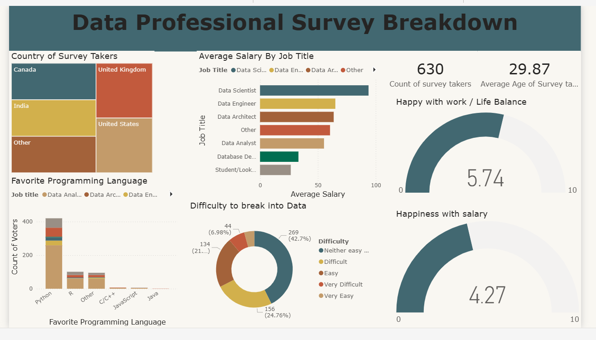

# Data Analyst Survey Analysis - Power BI

## 📊 Project Overview
This project analyzes a survey of data analysts to uncover insights about career paths, salaries, industries, and skills. The interactive dashboard is built in **Power BI** and helps visualize key trends for career planning and industry insights.

## 🔗 Live Dashboard
You can explore the interactive dashboard here:  
[**View Dashboard Online**](https://app.powerbi.com/groups/me/reports/4f6e50f3-e756-4049-8043-113987b8e735/c79a5228baab5caa4c9b?experience=power-bi)

> Note: If you don’t have a Power BI web link, you can upload your `.pbix` file to **Power BI Service** and get a shareable link.

## 🔍 Key Insights
- **Salary Distribution:** Across industries and experience levels  
- **Programming Languages:** Preferences among data analysts  
- **Career Transitions:** Trends entering the data analytics field  
- **Job Satisfaction:** Insights on work-life balance, management, and compensation  

## 🛠 Tools Used
- Power BI Desktop  
- DAX (Data Analysis Expressions) for calculations  
- Power Query for data cleaning and transformation  

## 📈 Dashboard Preview

## 💡 What I Learned
- Building a clean and interactive **data model** in Power BI  
- Creating **measures and KPIs** with DAX  
- Designing a **user-friendly dashboard** to summarize survey data  
- Insights extraction for **career and industry analysis**  

## 📂 Files Included
- `Data_Analyst_Survey_Analysis.pbix` – Power BI report  
- `dashboard.png` – Static screenshot of the dashboard
